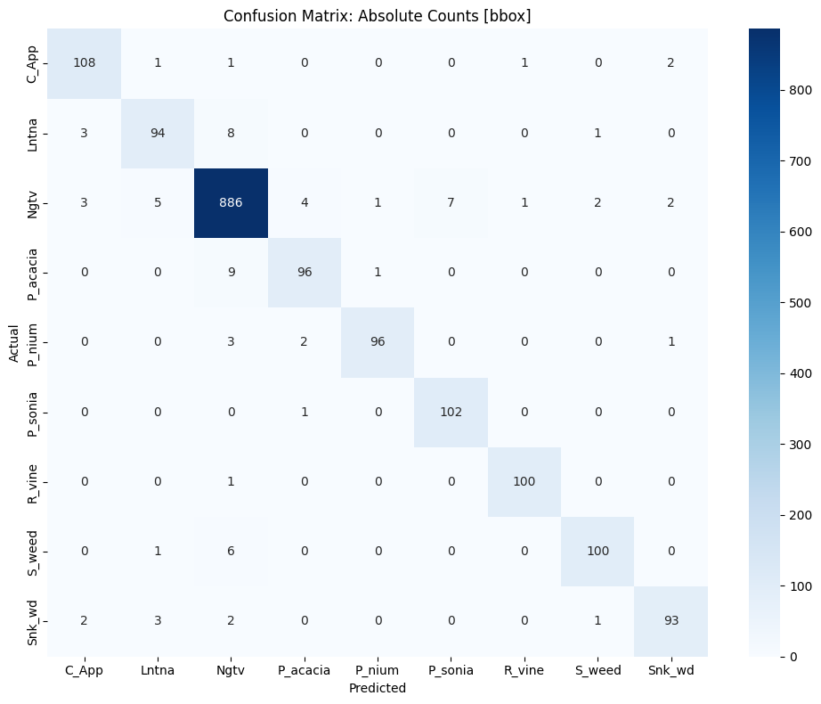
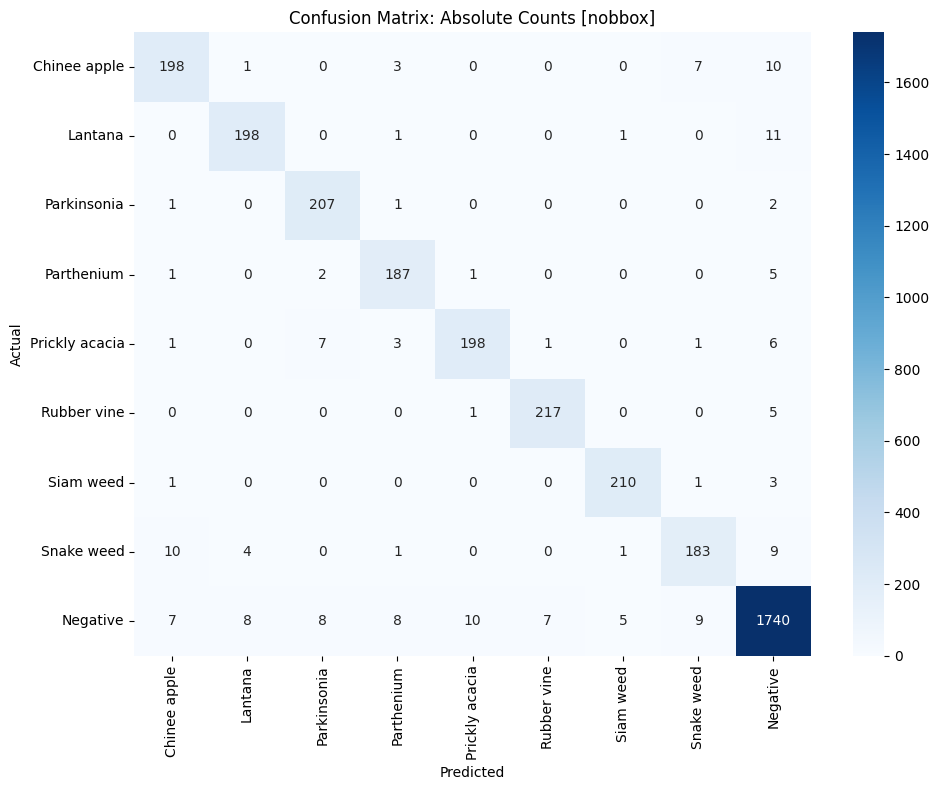
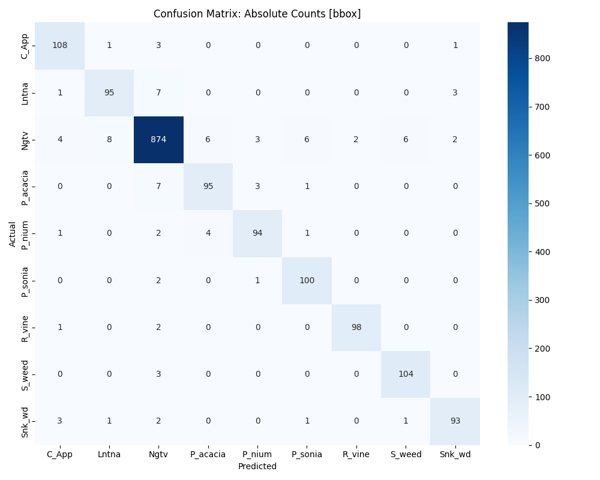
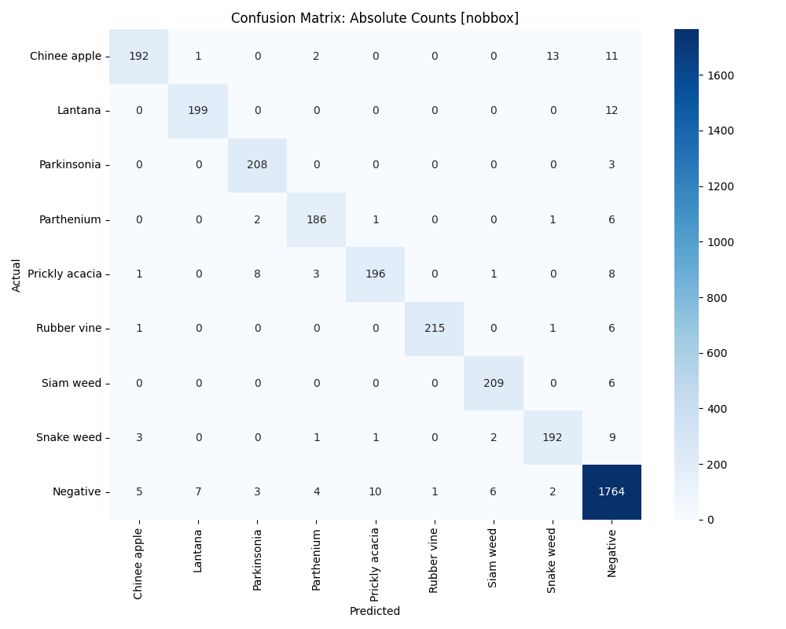
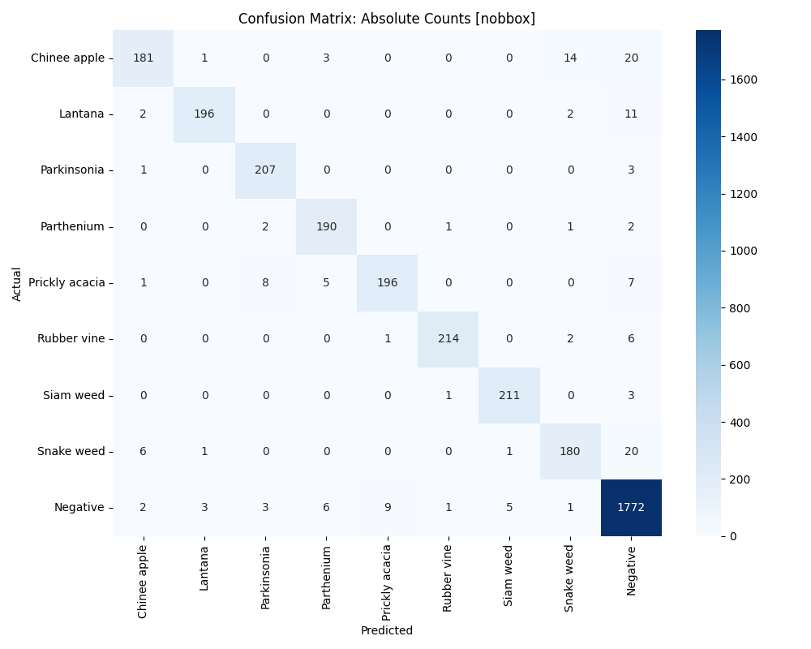

# DeepWeeds: Automated Classification of Australian Invasive Weed Species

A systematic comparison of CNN and Transformer deep learning architectures for 9-class invasive weed species classification, trained on the [DeepWeeds dataset](https://github.com/AlexOlsen/DeepWeeds). This project investigates two key research questions: whether Transformer-based architectures outperform CNNs for weed classification, and whether bounding box localisation from a Phase 1 detection model improves Phase 2 classification accuracy.

## Live Demo

Try the classifier — upload any field image and compare predictions across all 3 model architectures:

**[Launch Weed Classifier on Hugging Face Spaces](https://huggingface.co/spaces/sophiecloue/deepweeds-weed-classifier)**

## Key Results

| Model | Dataset | Accuracy | Precision | Recall | Macro F1 |
|---|---|---|---|---|---|
| EfficientNet-B3 | With BBox | 0.9571 | 0.9489 | 0.9442 | 0.9463 |
| EfficientNet-B3 | Without BBox | 0.9532 | 0.9378 | 0.9428 | 0.9401 |
| EfficientNet-V2-S | With BBox | 0.9491 | 0.9331 | 0.9403 | 0.9365 |
| EfficientNet-V2-S | Without BBox | 0.9597 | 0.9537 | 0.9440 | 0.9486 |
| Swin Transformer | With BBox | 0.9491 | 0.9331 | 0.9403 | 0.9365 |
| Swin Transformer | Without BBox | 0.9597 | 0.9537 | 0.9440 | 0.9486 |

> **Primary metric:** Macro F1 Score (accounts for class imbalance across 9 weed species)

## Research Questions

1. **CNN vs Transformer:** Do Transformer architectures (Swin-T) outperform CNNs (EfficientNet) for weed classification?
2. **Effect of Bounding Boxes:** Does bounding box localisation from Phase 1 detection consistently improve Phase 2 classification?
3. **Architectural Evolution:** Does EfficientNet-V2-S improve meaningfully over EfficientNet-B3?

## Key Findings

- **Best overall model:** EfficientNet-V2-S trained without bounding boxes (Macro F1: 0.9486)
- **Bounding boxes did not consistently help:** Models trained on full images outperformed bbox-cropped versions in most cases, suggesting that background context provides useful discriminative information for weed species classification
- **CNN vs Transformer:** EfficientNet-V2-S and Swin-T achieved comparable performance, suggesting CNN inductive biases remain competitive with global attention mechanisms on this dataset size
- **Hyperparameter tuning:** Optuna-based Bayesian optimisation provided meaningful improvements over default hyperparameters across all models, with learning rate identified as the most sensitive hyperparameter

## Architecture Comparison

| | EfficientNet-B3 | EfficientNet-V2-S | Swin Transformer |
|---|---|---|---|
| **Type** | CNN | CNN | Transformer |
| **Parameters** | ~12M | ~22M | ~28M |
| **Core mechanism** | MBConv + Compound Scaling | Fused-MBConv + Progressive Learning | Shifted Window Self-Attention |
| **Key strength** | Efficiency | Speed + Accuracy | Global feature modelling |
| **ImageNet Top-1** | 82.0% | 84.2% | 81.3% |

## Dataset

**DeepWeeds** — A multiclass weed species image dataset for deep learning  
([Olsen et al., 2019](https://www.nature.com/articles/s41598-018-38343-3))

The dataset is publicly available and can be downloaded from:
- **Official GitHub:** [github.com/AlexOlsen/DeepWeeds](https://github.com/AlexOlsen/DeepWeeds)
- **Kaggle:** [kaggle.com/datasets/imsparsh/deepweeds](https://www.kaggle.com/datasets/imsparsh/deepweeds)

After downloading, organise your folder structure as follows:
```
Project/
├── 300x300/          ← Annotated dataset (with bounding box XMLs)
│   ├── train/
│   ├── valid/
│   └── test/
├── train/            ← Non-annotated dataset
│   ├── images/
│   └── train_labels.csv
└── test/            ← Non-annotated dataset
│   ├── images/
│   └── train_labels.csv
```
**DeepWeeds** — 17,509 unique images across 9 classes (8 invasive weed species + Negative class), sourced from 8 field sites across Queensland, Australia.

| Class | Species | Images |
|---|---|---|
| C_App | Chinee Apple | ~1,100 |
| Lntna | Lantana | ~1,000 |
| Ngtv | Negative (No Weed) | ~9,108 |
| P_acacia | Prickly Acacia | ~1,000 |
| P_nium | Parthenium | ~1,000 |
| P_sonia | Sonsonia | ~1,000 |
| R_vine | Rubber Vine | ~1,000 |
| S_weed | Siam Weed | ~1,000 |
| Snk_wd | Snake Weed | ~1,000 |

## Grad-CAM Visualisations

Grad-CAM heatmaps reveal what each model focuses on when classifying weed species. The comparison between CNN and Transformer architectures shows distinct attention patterns — CNNs tend to focus on local texture features while Swin-T captures broader spatial structure.


## Confusion Matrices

<details>
<summary>EfficientNet-B3</summary>

**With Bounding Box**


**Without Bounding Box**


</details>

<details>
<summary>EfficientNet-V2-S</summary>

**With Bounding Box**


**Without Bounding Box**


</details>

<details>
<summary>Swin Transformer</summary>

**With Bounding Box**


**Without Bounding Box**


</details>

## Repository Structure
```
deepweed_classification/
│
├── notebooks/
│   ├── Efficientnet_B3.ipynb       ← Training pipeline for EfficientNet-B3
│   ├── Efficientnet_v2s.ipynb      ← Training pipeline for EfficientNet-V2-S
│   ├── Swin_T.ipynb      ← Training pipeline for Swin Transformer
│   └── gradcam_and_demo.ipynb      ← Grad-CAM visualisation & Gradio demo
│
├── results/
│   ├── confusion_matrices/            ← Confusion matrix plots for all 6 runs
│   └── gradcam_examples/              ← Grad-CAM heatmaps per weed class
│
├── app/
│   └── app.py                         ← Gradio demo (hosted on HF Spaces)
│
├── requirements.txt
└── README.md
```
## Training Methodology

- **Framework:** PyTorch with pretrained ImageNet weights (transfer learning)
- **Optimiser:** Adam with CosineAnnealingLR scheduler
- **Hyperparameter tuning:** Optuna (20 trials, Bayesian optimisation) over learning rate, weight decay and dropout rate
- **Validation strategy:** Stratified 5-Fold Cross Validation
- **Checkpoint criterion:** Best validation Macro F1
- **Early stopping:** Patience of 5 epochs
- **Image size:** 224×224
- **Batch size:** 32
- **Max epochs:** 15
- **Random seed:** 42

## Setup

```bash
git clone https://github.com/sophiecloue/deepweed_classification.git
cd deepweed_classification
pip install -r requirements.txt
```

To run the notebooks, upload to [Google Colab](https://colab.research.google.com) and follow the setup instructions at the top of each notebook. A GPU runtime is strongly recommended.

Model weights are hosted on Hugging Face:
[sophiecloue/deepweeds-classifier](https://huggingface.co/sophiecloue/deepweeds-classifier)

## References

- Olsen, A., et al. (2019). DeepWeeds: A multiclass weed species image dataset for deep learning. *Scientific Reports*.
- Tan, M., & Le, Q. V. (2019). EfficientNet: Rethinking model scaling for convolutional neural networks. *ICML*.
- Tan, M., & Le, Q. V. (2021). EfficientNetV2: Smaller models and faster training. *ICML*.
- Liu, Z., et al. (2021). Swin Transformer: Hierarchical vision transformer using shifted windows. *ICCV*.
- Akiba, T., et al. (2019). Optuna: A next-generation hyperparameter optimization framework. *KDD*.
